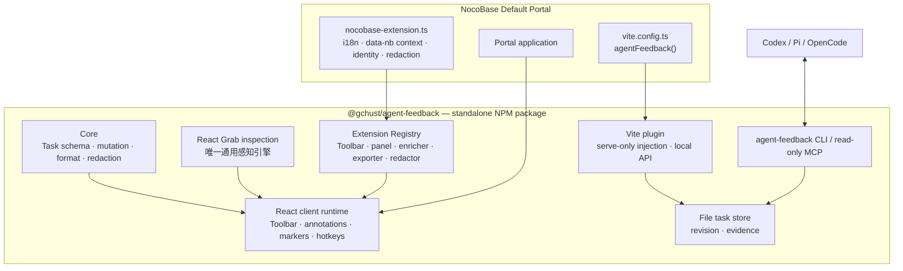

# Shared product and engineering contract

本文件是所有 Goal 的最高任务合同。若某个阶段的实现建议与实际仓库结构冲突，可以调整具体文件路径，但不能改变本文件中的最终不变量。调整必须记录在当前 Goal 的 Decision Log。

## 1. 当前代码事实

当前 `portal-template-default` 分支中，Studio 主要包括：

```text
src/studio/**                         约 15K 行 TypeScript/TSX
scripts/portal-studio-*               CLI / MCP / audit
vite.config.ts                        直接注册 portalStudioPlugin
package.json                          react-grab、tsx、Studio scripts
测试                                  tests/logic/portal-studio/**、组件和 E2E
```

已知直接宿主耦合包括：

- `@nocobase/portal-sdk/i18n`；
- NocoBase error redactor；
- `data-nb-*` 与 `data-ai-page-element`；
- `NOCOBASE_PORTAL_STUDIO_*`；
- PortalStudio 命名、endpoint 和 `.portal-studio`；
- Vite config 直接导入 `src/studio/vite`。

当前底层感知已经使用 `react-grab/primitives`，但通用能力仍完全内置在模板。

## 2. 最终架构



## 3. 非协商最终不变量

### 3.1 独立包边界

最终独立包：

- 不导入任何 `@nocobase/*`；
- 不出现 `data-nb-`、`data-ai-page-element`、`NOCOBASE_` 硬编码；
- 不以 Portal Studio 作为公共名称；
- 不读取 Default Portal 内部文件；
- 可以在完全没有 NocoBase 的 React/Vite 应用中运行。

### 3.2 单包、子路径 exports

第一版只发布一个包：

```text
@gchust/agent-feedback
@gchust/agent-feedback/vite
@gchust/agent-feedback/extension
@gchust/agent-feedback/types
```

可增加 `./testing` 作为非生产测试入口，但不得暴露内部文件路径。

### 3.3 唯一感知引擎

- `react-grab@0.1.50` 是唯一通用感知引擎；
- 只有一个内部文件可以 import `react-grab/primitives`；
- 不直接安装或 import `element-source`；
- 不 import React Grab 默认 UI；
- 不保留自研 Fiber/Vite 正则 source fallback；
- Marker 重新定位是任务恢复能力，不得演变成第二感知引擎。

### 3.4 全新协议，无旧兼容

新包使用：

```text
schema id:      agent-feedback.task.v1
schema version: 1
data dir:       .agent-feedback
endpoint:       /__agent-feedback
token header:   x-agent-feedback-token
```

不读取、不迁移：

- `.portal-studio`；
- PortalStudio schema v1–v6；
- 旧 endpoint；
- 旧 token/header；
- 旧 MCP capture payload。

发现旧目录时只允许显示迁移提示或忽略；禁止实现兼容读取。

### 3.5 Built-in 与第三方扩展同权

Pick、Multi、Area、Copy、Marker Visibility、Shortcut Help、Annotation List 都必须由官方 built-in extension 使用公开 Registry 注册。

核心 Toolbar 不允许保留：

```ts
switch (actionId) { ... }
```

来特判内置动作。第三方扩展使用同一 contribution 类型、排序、Tooltip、快捷键、Panel 和生命周期。

### 3.6 Default Portal 极薄

Goal 08 后，模板中允许保留的 Studio 集成仅限：

```text
package.json 中一个 NPM 依赖和可选 CLI 别名
vite.config.ts 中一次插件注册
src/agent-feedback/nocobase-extension.ts（或最多三个薄文件）
.gitignore 中 .agent-feedback
少量 NocoBase 集成 E2E
```

禁止保留：

```text
src/studio/**
scripts/portal-studio-*
通用 package tests 的复制
react-grab 直接依赖
只为旧内置 Studio 服务的 tsx 依赖
活跃的旧 ExecPlan
```

非测试 NocoBase 适配源码目标：不超过 300 行、最多 3 个文件。若必须超过，需在 Goal 08 Decision Log 用实际宿主合同解释，不能因为复制通用逻辑而超过。

### 3.7 Bug 只能在通用包中修

以下问题必须在独立包解决，Default Portal 不得另写补丁：

- source path canonicalization；
- basename 猜文件；
- source revision；
- CLI/MCP schema；
- screenshot 样式/媒体/滚动/缩放；
- iframe 与 ShadowRoot 跨 realm；
- Freeze 重复 monkey patch；
- Region 去重与截断；
- Marker observer；
- host ignore 属性。

NocoBase Extension 只负责：

- NocoBase locale/translation；
- NocoBase business context；
- NocoBase strong/contextual identity 属性；
- NocoBase-specific redaction；
- 可选品牌标题或额外 toolbar contribution。

## 4. 公共包 API

### 4.1 Package exports

最终 `package.json` 至少提供：

```json
{
  "type": "module",
  "exports": {
    ".": {
      "types": "./dist/client/index.d.ts",
      "import": "./dist/client/index.js"
    },
    "./vite": {
      "types": "./dist/vite/index.d.ts",
      "import": "./dist/vite/index.js"
    },
    "./extension": {
      "types": "./dist/extension/index.d.ts",
      "import": "./dist/extension/index.js"
    },
    "./types": {
      "types": "./dist/types/index.d.ts",
      "import": "./dist/types/index.js"
    }
  },
  "bin": {
    "agent-feedback": "./dist/cli/index.js"
  }
}
```

具体 dist 文件名可由 tsdown 调整，但公开子路径不得改变。

### 4.2 Vite plugin

```ts
import agentFeedback from "@gchust/agent-feedback/vite";

agentFeedback({
  root,
  dir: ".agent-feedback",
  endpoint: "/__agent-feedback",
  allowRemote: false,
  clientExtensions: [absoluteBrowserModulePath],
});
```

要求：

- `apply: "serve"`；
- 使用 namespaced virtual module；
- 自动注入 Client Runtime；
- production build 不包含 Client Runtime、token 或 endpoints；
- extension module path 由 Vite 虚拟模块在浏览器侧 import；
- 不要求宿主修改 React `main.tsx`。

### 4.3 Client Extension

```ts
export interface AgentFeedbackClientExtension {
  id: string;
  apiVersion: 1;
  setup?(context: AgentFeedbackExtensionContext): void | (() => void);
  toolbar?: ToolbarContribution[];
  panels?: PanelContribution[];
  targetEnrichers?: TargetEnricher[];
  exporters?: FeedbackExporter[];
  redactors?: FeedbackRedactor[];
  messages?: LocaleMessages;
  host?: HostIntegration;
}
```

注册器：

```ts
export function defineClientExtension(
  extension: AgentFeedbackClientExtension
): AgentFeedbackClientExtension;
```

### 4.4 Toolbar contribution

```ts
export interface ToolbarContribution {
  id: string;
  group: "capture" | "handoff" | "view" | "host";
  order?: number;
  label: LocalizedText;
  icon: React.ComponentType<IconProps>;
  shortcut?: ShortcutDefinition;
  kind: "action" | "toggle" | "panel";
  isVisible?(snapshot: StudioPublicSnapshot): boolean;
  isEnabled?(snapshot: StudioPublicSnapshot): boolean;
  isPressed?(snapshot: StudioPublicSnapshot): boolean;
  execute?(context: ToolbarCommandContext): void | Promise<void>;
  panelId?: string;
}
```

### 4.5 Panel contribution

```ts
export interface PanelContribution {
  id: string;
  title: LocalizedText;
  render: React.ComponentType<{
    studio: StudioPublicApi;
    close(): void;
  }>;
  placement?: "above" | "below" | "auto";
  exclusiveGroup?: string;
}
```

### 4.6 Target enrichers and extension data

```ts
export interface TargetEnricher {
  id: string;
  enrich(context: {
    element: Element;
    inspection: InspectedTarget;
  }): JsonObject | null | Promise<JsonObject | null>;
}
```

Extension 数据只可写入：

```ts
annotation.extensions[extensionId]
```

规则：

- JSON-safe；
- 单 Extension 数据大小有上限；
- 经核心 redaction；
- 不能写 Task 顶层；
- 不能覆盖其他 Extension namespace。

### 4.7 Public API 只暴露查询和命令

```ts
export interface StudioPublicApi {
  getSnapshot(): StudioPublicSnapshot;
  subscribe(listener: (snapshot: StudioPublicSnapshot) => void): () => void;
  commands: {
    capture: {
      startPick(): void;
      startMulti(): void;
      startArea(): void;
      cancel(): void;
    };
    annotations: {
      copyOpen(): Promise<void>;
      complete(id: string): Promise<void>;
      reopen(id: string): Promise<void>;
      remove(id: string): Promise<void>;
      removeCompleted(): Promise<void>;
    };
    markers: {
      show(): void;
      hide(): void;
      focus(annotationId: string): void;
    };
    panels: {
      open(id: string): void;
      close(id?: string): void;
    };
  };
}
```

禁止公开 React setters、内部 reducer action 或 live DOM/Fiber。

## 5. Registry 不变量

- extension ID 冲突：明确报错；
- contribution ID 冲突：明确报错；
- shortcut 冲突：明确报错；
- 排序：group 固定顺序，再按 `order`，最后按 ID；
- Help 面板必须从同一快捷键 Registry 自动生成；
- Tooltip、aria-label、实际 listener 和 Help 内容共享一个事实来源；
- setup disposer 在 HMR/unmount 时执行；
- HMR 不得重复注册；
- 外部扩展异常不能静默覆盖内置项；
- built-in extension 使用相同公开类型和注册路径。

## 6. Task schema v1

最终使用通用命名，例如：

```ts
export interface AgentFeedbackTask {
  schema: "agent-feedback.task.v1";
  schemaVersion: 1;
  taskId: string;
  taskRevision: number;
  status: "active" | "completed";
  createdAt: string;
  updatedAt: string;
  annotations: AgentFeedbackAnnotation[];
}
```

Annotation 保留：

- 稳定 ID；
- route/page context；
- comment；
- one/many targets 或 region；
- open/completed；
- completion evidence；
- generic inspection；
- namespaced extensions；
- screenshot/evidence references。

不得包含：

- PortalStudio 类型名；
- NocoBase 顶层字段；
- live Element；
- Fiber；
- React Grab 私有对象；
-旧 schema 兼容分支。

## 7. 安全边界

- Vite API 默认仅 loopback；
- remote 必须显式 opt-in；
- 随机 session token；
- Host/Origin/Referer 校验；
- token 不写入页面任务；
- 请求体、响应体、cookie、Authorization 默认不采集；
- input/textarea/password value 不采集；
- source path 必须经 server root canonicalization；
- API 不提供任意 shell 或任意文件读取；
- CLI 只操作 `.agent-feedback` 合同范围；
- production build 完全剔除。

## 8. 测试层次

### 包内单元/组件测试

- schema、mutation、format、redaction；
- inspection、marker locator、region；
- Registry、ID/shortcut 冲突、lifecycle；
- UI、hotkey、Tooltip、Panel；
- endpoint、store、source path、CLI。

### 通用 React/Vite Playground E2E

- Pick/Multi/Area；
- annotation create/edit/delete；
- marker reload；
- Open/Completed/Reopen；
- Copy；
- source file/line/column；
- Portal、Shadow Root、same-origin iframe；
- scrolling、image、canvas/chart；
- HMR；
- production exclusion。

### Packed tarball fixture

每次涉及包边界的 Goal 必须：

```bash
pnpm pack
```

并把 tarball 安装到一个不通过 workspace link 解析源码的空白 Fixture 中。

### NocoBase integration

模板只测试：

- NocoBase Extension 注册；
- `data-nb-*` 写入 namespace；
- NocoBase locale；
-真实 Portal 选择与批注；
- production exclusion；
- Agent CLI 与完成状态。

## 9. Source integrity 合同

- 浏览器不得伪装绝对路径为相对路径；
- server 使用实际 root 做 canonicalization；
- 不按 basename 猜第一个同名文件；
- 无法唯一映射时 `source = null/unresolved`；
- benchmark 断言完整 workspace-relative path、line、column；
- duplicate basename fixture 必须通过；
- source revision 只使用精确 canonical path。

## 10. Evidence 和运行时合同

- Screenshot 不宣称像素级，但必须保留结构和 viewport 对齐；
- CSS property 使用合法 kebab-case；
- 删除/替换媒体不得打乱 source/clone 映射；
- 滚动和缩放有真实浏览器测试；
- iframe/ShadowRoot 判断必须跨 realm；
- 不保留自定义全局 rAF fallback；
- Freeze 只使用 React Grab 公共能力；
- Region 先收集再评分/去重，最后截断；
- Marker observer 只在存在真正可见 Marker 时工作。

## 11. ExecPlan 维护要求

每个 Goal 文件中的以下部分必须由 Agent 持续更新，而不是最后一次性填写：

- Progress；
- Surprises & Discoveries；
- Decision Log；
- Outcomes & Retrospective。

每个验收标准必须标记 PASS/FAIL/BLOCKED，并附命令或证据路径。

## 12. 停止与阻塞

遇到以下情况必须停止当前 Goal，不能改变架构绕过：

- 无法写入 sibling repo；
- React Grab 公共 API 无法满足已声明合同；
- packed tarball 无法在干净 Fixture 解析；
- 必须引入 NocoBase 依赖才能让通用包运行；
- 只能依赖 workspace link 才能通过；
- 需要保留旧 schema/fallback 才能继续；
- 发布版本尚不存在却执行 Goal 10。

报告必须包含：尝试路径、证据、阻塞点和解除阻塞所需的最小输入。
