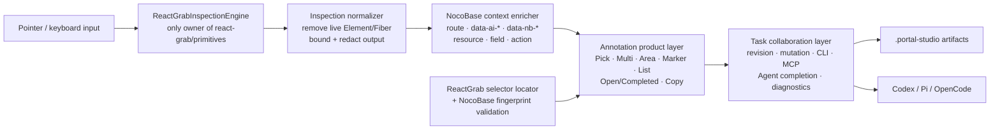

# Shared contract: replace the custom perception engine with React Grab primitives

This contract applies to Goals 01–06. It is normative. If a numbered Goal conflicts with this file, this file wins unless the user explicitly changes the product decision.

This is a living migration contract, but the final-state invariants in sections 2–8 are frozen. Each Goal must keep its own `Progress`, `Surprises & Discoveries`, `Decision Log`, and `Outcomes & Retrospective` current.

## 1. Purpose / big picture

After all Goals are complete, a user keeps the current Portal Studio product experience:

- draggable/collapsible horizontal toolbar;
- Pick, Multi-select and Select Region;
- numbered persistent annotations;
- marker-local edit/delete/complete/reopen;
- Open/All list and Remove completed;
- Copy to Codex/Pi/OpenCode;
- Code Agent completion synchronization;
- task revisions and conflict handling;
- console/fetch/XHR diagnostics, screenshots and HMR verification;
- NocoBase route/resource/field/action context;
- redaction, size limits and dev-only production exclusion.

The difference is invisible but important: generic DOM/React perception is no longer maintained by NocoBase. `react-grab/primitives` becomes the only generic engine for hit testing, element filtering, top-level bounds, stable selector generation, React component/source context and page freeze.

## 2. Final architecture



### Ownership boundary

`react-grab/primitives` answers:

- what selectable element is under the pointer;
- whether an element is a useful target;
- top-level viewport bounds, including supported same-origin iframe cases;
- a stable selector using React Grab's documented boundary markers;
- component name, source file, line, column and source stack;
- HTML preview and computed style context;
- freeze/unfreeze behavior and baseline-style cleanup.

Portal Studio continues to answer:

- what the target means in NocoBase;
- how multiple targets become one annotation;
- how a region is represented;
- how annotations persist and reattach after reload;
- task status, revision, completion and Agent handoff;
- diagnostics, screenshots, security and production exclusion.

## 3. Upstream choice is fixed

Use exactly one direct perception dependency:

```json
"react-grab": "0.1.50"
```

The implementing Agent must inspect the installed package and generated type declarations before coding. If the exact version cannot be installed or its public primitives fail the Goal 01 promotion gates, stop with evidence. Do not silently choose another library and do not create a fallback.

Allowed import surface:

```ts
import {
  getElementAtPoint,
  getElementsAtPoint,
  isElementGrabbable,
  getElementBounds,
  getElementSelector,
  getElementContext,
  freeze,
  unfreeze,
  isFreezeActive,
  disposeBaselineStyles,
} from "react-grab/primitives";
```

Not allowed:

```ts
import "react-grab";
import("react-grab");
import ... from "react-grab/dist/...";
import ... from "react-grab/src/...";
import ... from "element-source";
```

Do not copy upstream private implementation into this repository. Use only documented package exports.

## 3a. Semantic target promotion (user-approved contract amendment, 2026-08-11)

The user explicitly approved continuing with `react-grab@0.1.50` and revised G01-AC06: a nested SVG path returned by `getElementAtPoint()` is no longer by itself a promotion blocker when the same public primitives provide a deterministic useful target through `getElementsAtPoint()`.

This section is normative for every Goal. Goals 01 and 02 must implement exactly this rule; nothing else may change the raw hit result.

### The promotion rule

With ordinary pointer events, a pointer-event-enabled decorative SVG shape is itself grabbable upstream, so `getElementAtPoint()` legitimately returns the raw `path`/`rect`/… shape. The single perception path applies the following deterministic, bounded rule, using only `react-grab/primitives` and ordinary DOM semantics:

1. Take the public hit stack `getElementsAtPoint(x, y)` (grabbable elements, topmost first, crossing open shadow roots and same-origin iframes) and the raw selection `getElementAtPoint(x, y)`.
2. If the raw hit is not an SVG geometry shape (`path`, `rect`, `circle`, `ellipse`, `line`, `polyline`, `polygon`), it is the useful target. Plain controls, overlay-resolved hits, Shadow DOM and iframe hits are returned exactly as the primitive reports them.
3. If the raw hit is an SVG geometry shape and is itself an interactive control (for example `role="button"`), keep it.
4. Otherwise walk the public stack outward from the raw hit. Promote to the FIRST entry that is simultaneously:
   - the composed DOM parent of the previous entry (light-DOM parent or open shadow host), so the walk stops at the first non-ancestor and can never jump to an unrelated element;
   - an interactive control: `button`, `a[href]`, `input:not([type="hidden"])`, `select`, `textarea`, `summary`, `iframe`, `audio[controls]`, `video[controls]`, `embed`, `object`, `[role="button"]`, `[role="link"]`, `[role="tab"]`, `[role="menuitem"]`, `[role="menuitemcheckbox"]`, `[role="menuitemradio"]`, or `[contenteditable]:not([contenteditable="false"])`;
   - grabbable per `isElementGrabbable()`.
5. If no interactive control ancestor exists, keep the raw shape. A standalone decorative SVG must not jump to an unrelated `section`/`main` ancestor.

Forbidden in the promotion path, unchanged from this contract: no fuzzy page-wide search, no candidate persistence, no selector fallback, no second perception engine, no private React Grab paths, no copied internals, no package patch, no default UI.

This rule is the behavior Goal 02 must implement in the sole production adapter; Goal 01 proves it with test-only code and real-browser evidence.

## 4. One direct-import owner

Exactly one active repository file may import `react-grab/primitives` in the final state:

```text
src/studio/inspection/react-grab-engine.ts
```

All other Studio code consumes a repository-owned interface exported from:

```text
src/studio/inspection/types.ts
src/studio/inspection/index.ts
```

Tests, E2E and scripts must import the repository-owned interface rather than the upstream package. Goal 01 may temporarily use a test-only direct import to prove the package before the adapter exists; Goal 02 must consolidate that import into the sole owner and rewrite the contract tests through the adapter. The §3a promotion rule is part of the perception path: Goal 01 proves it from test-owned code, and Goal 02 must move the exact rule into the sole adapter so production and tests share one implementation. This is an ownership boundary, not a fallback abstraction. There is only one implementation.

## 5. Final schema v6 contract

The final task format is schema version 6 only. Keep the current annotation-first product semantics, but replace every legacy selector/component/source candidate array with one normalized React Grab result. The exact TypeScript names may adapt to repository conventions; the persisted fields and invariants below are normative.

```ts
export const TASK_SCHEMA_VERSION = 6 as const;

export type SourceFrame = {
  filePath: string;          // workspace-relative POSIX path only
  lineNumber: number;        // positive integer
  columnNumber: number;      // non-negative integer
  componentName: string | null;
};

export type ElementFingerprint = {
  tagName: string;
  role: string;
  accessibleName: string;
  text: string;
  identityAttributes: Record<string, string>;
  childCount: number;
  parent: { tagName: string; role: string };
};

export type ElementCapture = {
  tagName: string;
  selector: string;          // one React Grab selector; no candidate array
  bounds: { x: number; y: number; width: number; height: number };
  componentName: string | null;
  source: SourceFrame | null;
  sourceStack: SourceFrame[];
  htmlPreview: string;
  styleText: string;
  fingerprint: ElementFingerprint;
};

export type Region = {
  coordinateSpace: "document";
  x: number;
  y: number;
  width: number;
  height: number;
};

export type AnnotationPageContext = {
  url: string;
  routeKey: string;
  title: string;
  viewport: { width: number; height: number };
  scroll: { x: number; y: number };
  businessContext: BusinessContextItem[];
};

export type Annotation = {
  annotationId: string;
  kind: "element" | "multi" | "region";
  comment: string;
  createdAt: string;
  status: "open" | "completed";
  completedAt?: string;
  completedEvidence?: {
    verified: boolean;
    summary: string;
    source: "cli";
    completedAt: string;
  };
  hidden?: boolean;
  elements: ElementCapture[];
  region?: Region;
  pageContext: AnnotationPageContext;
};

export type PortalStudioTask = {
  schemaVersion: 6;
  taskId: string;
  createdAt: string;
  updatedAt?: string;
  url: string;
  title: string;
  annotations: Annotation[];
  businessContext: BusinessContextItem[];
  redaction: RedactionManifest;
  screenshot?: ScreenshotRef;
  diagnostics?: DiagnosticEntry[];
  heartbeat?: HeartbeatReport;
  revision?: RevisionInfo;
  taskRevision?: number;
  completedAt?: string;
};
```

### v6 invariants and limits

- `selector`: non-empty, maximum 4096 characters;
- `sourceStack`: maximum 12 frames;
- `htmlPreview`: maximum 4000 characters after redaction;
- `styleText`: maximum 6000 characters after redaction;
- `accessibleName`: maximum 500 characters;
- fingerprint `text`: maximum 1000 characters;
- `identityAttributes`: only `id`, `data-ai-page-element` and safe `data-nb-*` keys; maximum 30 entries; each value maximum 500 characters;
- do not persist input/textarea/select values, password values, cookies, authorization data or arbitrary event/runtime properties;
- source paths outside the workspace root or inside `node_modules` are omitted from persisted source context;
- no live `Element`, Fiber object, React Grab internal object, error object or function is persisted;
- `pageContext` is required for every new v6 annotation;
- region coordinates are document-relative so scrolling does not move the saved region to another part of the page;
- the formatter, CLI, MCP and revision code consume this same v6 model and may not maintain parallel DTOs with legacy candidate terminology.

### Unsupported old artifacts

This feature is unreleased. Final code must not normalize or migrate schema v1–v5. A task with `schemaVersion !== 6` must produce one typed `unsupported_schema` result containing the actual version, expected version and a safe instruction to clear the dev-only task. Browser, endpoint, print, verify, CLI and MCP must share this behavior. Do not silently reinterpret the artifact.

## 6. Marker rehydration is retained, but not as a second perception engine

Persistent markers need to reattach after reload. Keep one small locator owned by Portal Studio:

```text
src/studio/inspection/react-grab-selector-locator.ts
```

This locator resolves and validates the one public selector produced by React Grab. It does not perceive source code, generate alternatives or call another engine.

### Exact selector-resolution rules

1. Reject an empty or over-limit selector.
2. Resolve ordinary CSS segments with `querySelectorAll`, not `querySelector`. Every segment must match exactly one element; zero means `missing`, more than one means `ambiguous`.
3. `>>>` means that the uniquely resolved preceding element must expose an open `shadowRoot`; continue in that root. Closed or absent roots are `unsupported_boundary`.
4. `>>iframe>>` means that the uniquely resolved preceding element must be an `HTMLIFrameElement` with an accessible same-origin `contentDocument`; continue in that document. Cross-origin or unavailable documents are `unsupported_boundary`.
5. The final result must be connected and outside the Studio host/subtree.
6. Never choose the first of several matches and never search another selector when a segment fails.

### Exact fingerprint-validation rules

The selector result is accepted only after the following deterministic validation. Normalize all compared text by trimming, collapsing whitespace and applying the same length bounds used at capture time.

1. `tagName` must match exactly; otherwise return `fingerprint_mismatch`.
2. If any captured strong identity attribute exists (`id`, `data-ai-page-element`, or any `data-nb-*`), every captured strong identity key/value must still match exactly. A missing or changed strong identity value is a hard mismatch.
3. If no strong identity attribute exists, calculate this score:
   - role exact and non-empty: `+2`; role changed: `-4`;
   - accessible name exact and non-empty: `+3`; changed: `-3`;
   - text exact and non-empty: `+3`; changed: `-2`;
   - parent tag and role both exact: `+1`; otherwise `-1`;
   - child count exact: `+1`; difference of one: `0`; larger difference: `-1`.
4. In the no-strong-identity case, accept only when score is at least `4` and at least one non-empty semantic signal among role, accessible name or text matched exactly.
5. If the captured target has no strong identity and all three semantic signals are empty, accept only when parent tag/role and child count match exactly.
6. Return a typed result: `resolved`, `missing`, `ambiguous`, `unsupported_boundary`, `fingerprint_mismatch`, or `invalid_selector`. Include a bounded diagnostic reason, never raw page data.

The algorithm is intentionally conservative. A changed label may make an open marker unresolved until the Agent completes it; that is acceptable. A wrong marker attached to a different control is not acceptable.

### Explicitly forbidden behavior

The locator must not:

- generate alternative selectors;
- scan React Fiber;
- search source modules;
- try role-only, class-only or DOM-path fallbacks;
- perform fuzzy page-wide search;
- return the first vaguely matching element;
- call `element-source` or any second perception implementation.

## 7. Required legacy deletion

By the end of Goal 05, production source and active tests must contain none of the following legacy perception mechanisms:

- `src/studio/grab.ts`;
- direct `__reactFiber$` reads;
- `findFiberKey`, `collectComponentChain`, `readFiberTypeName`;
- `collectSelectorCandidates`;
- `collectComponentCandidates`;
- `readHostComponentName` based on Fiber;
- `SelectorCandidate`, `ComponentCandidate`, `SourceCandidate` and their arrays;
- Vite `moduleGraph` / `transformResult.code` component-name scanning;
- `resolveComponentSources`;
- `assignSourceCandidates`;
- server-side source-candidate backfill;
- schema v1/v2/v4/v5 constants and normalizers;
- runtime `legacy`, `fallback`, `try old engine`, or equivalent branches.

The final code may keep ordinary DOM snapshot/redaction helpers and NocoBase business-context collection. Those are product normalization, not a generic perception engine.

## 8. Product invariants that must not regress

1. The horizontal toolbar remains draggable and collapsible.
2. Feature-icon order remains Pick, Multi, Area, Copy, Marker visibility, Shortcut help, Annotation list; collapse remains separate chrome.
3. Pick creates one-target annotations; Multi creates one annotation with multiple targets; Area creates one region annotation with semantically selected targets.
4. Annotation comments, marker numbers, list, edit/delete/complete/reopen and Open/All continue to work.
5. Copy defaults to open annotations and uses the shared formatter.
6. Agent completion commands still update the browser within the existing bounded sync window.
7. Task revision conflicts remain explicit; no last-writer-wins overwrite is introduced.
8. Diagnostics and screenshots remain bounded and redacted.
9. Studio remains dev-only and absent from the production module graph and `dist` output.
10. No NocoBase backend data is mutated by Portal Studio.

## 9. Security invariants

- React Grab output is untrusted input and must pass client and server normalization.
- Never persist cookies, Authorization headers, form values, password values, tokens or request/response bodies.
- Normalize source paths relative to the workspace root; reject traversal and external paths.
- Keep existing endpoint token, loopback/default-remote boundary, request caps, atomic writes and revision checks.
- React Grab default UI must never mount, because it would introduce a second event/clipboard interaction path.
- The Studio Shadow host must carry `data-react-grab-ignore` and the engine filter must exclude it.

## 10. Verification philosophy

Every acceptance criterion must point to at least one of:

- a deterministic unit/component test;
- a Playwright browser scenario;
- a build/typecheck/lint command;
- an exact grep/AST negative assertion;
- an artifact such as a screenshot, JSON task or benchmark report.

“Looks correct”, “implemented”, “works locally” and “tests should pass” are not evidence.

## 11. Required Goal workflow

For each numbered Goal:

1. inspect actual HEAD and update the Goal's `Context and orientation` if paths differ;
2. update `Progress` before and after each checkpoint;
3. run the narrowest relevant tests after each meaningful change;
4. record unexpected upstream or repository behavior in `Surprises & Discoveries` with evidence;
5. record design choices in `Decision Log`;
6. perform an independent acceptance pass before claiming completion;
7. fill `Outcomes & Retrospective` and report each AC as PASS, FAIL or BLOCKED;
8. do not start the next Goal.

## 12. Source basis

The plan is based on the current repository snapshot in which:

- custom Fiber access lives in `src/studio/grab.ts` and `src/studio/capture.ts`;
- source guessing lives in `src/studio/vite.ts` through `resolveComponentSources` and `assignSourceCandidates`;
- marker recovery uses the first matching `selectorCandidates` entry in `src/studio/markers.ts`;
- task schema v5 stores `selectorCandidates`, `componentCandidates` and `sourceCandidates`;
- `src/studio/toolbar.tsx` owns Pick/Multi/Area integration.

Actual HEAD wins if files moved, but the final invariants do not change.

## 13. Research basis

- OpenAI Codex Goals: one objective and one stopping condition; completion must be audited against concrete evidence.
- OpenAI ExecPlans: long tasks maintain Progress, Surprises & Discoveries, Decision Log and Outcomes & Retrospective; independent library spikes are recommended.
- React Grab public README: custom interfaces are supported through `react-grab/primitives`.
- React Grab v0.1.50 public primitives: hit testing, grabbability, bounds, selector, element context, freeze/unfreeze and editor opening.
- React Grab is MIT licensed.
